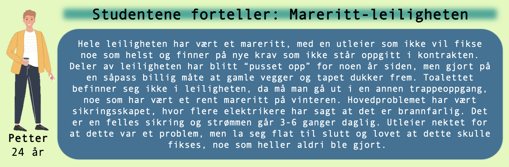

<!-- Main -->

<!-- One -->
<section id="one">
	

    
Det er noen ting som er lurt å se etter når du er på visning av boligen du vurderer å leie. Derfor har vi ramset opp en oversikt som du kan bruke når du er på visning!

		<header class="major">
			<h3 id="content">Brann, rømming og sikkerhet</h3>
		</header>

<!-- Content -->
<h4 id="content">Røykvarsler og brannalarm</h4>

    <ul style="list-style-type:disc; margin-bottom:0em; margin-left:3.25em">
        <li>Det skal være tilstrekkelig med brannalarmer slik at alarmen høres i alle rom i boligen, uavhengig om døren er åpen eller lukket. I tillegg skal det vere minimum én brannalarm per bolig.</li>
    </ul>

<h4 id="content">Slukkeutstyr</h4>

    <ul style="list-style-type:disc; margin-bottom:0em; margin-left:3.25em">
        <li>Slukkeutstyr som brannslukningsapparat eller brannslange med enten skum eller pulver skal være lett tilgjengelig i leiligheten.</li>
    </ul>

<h4 id="content">Rømningsveier</h4>

    <ul style="list-style-type:disc; margin-bottom:0em; margin-left:3.25em">
        <li>Hver bolig og hvert soverom skal ha i hvert fall én rømningsvei som leder ut av bygget.</li>
		<li>Flere av vinduene bør være av god størrelse (minst 1,5 kvadratmeter) med mulighet for å åpning og bruk som en alternativ rømningsvei.</li>
    </ul>

<h4 id="content">El-sikkerhet</h4>

    <ul style="list-style-type:disc; margin-bottom:0em; margin-left:3.25em">
		<li>Elektrisk utstyr og sikringer som er for varme kan være brannfarlig. Et sikringskap skal være koblet opp av en sertifisert elektriker. Se gjerne etter en signert sikringoversikt inne i sikringsskapet. En kursfortegnelse med navn og signatur viser at sikringsskapet har blitt installert i forskriftsmessig stand.</li>
    </ul>

<h4 id="content">Nøkler</h4>

    <ul style="list-style-type:disc; margin-bottom:0em; margin-left:3.25em">
		<li>Få oversikt over antall nøkler som tilhører boligen. Ytterdører skal være solide og ha mulighet for å låses.</li>
    </ul>

  
<!-- Two -->
<section id="two">
	

		<header class="major">
			<h3 id="content">Helse og miljø</h3>
		</header>

<!-- Content -->
<h4 id="content">Ventiler og avtrekk</h4>

    <ul style="list-style-type:disc; margin-bottom:0em; margin-left:3.25em">
        <li>Det skal være tilstrekkelig med ventiler og avtrekk for utlufting, spesielt på bad. Dette er essensielt for å bevare god helse, men også for å unngå fukt og mugg.</li>
    </ul>

<h4 id="content">Enkel åpning av dører og vinduer</h4>

    <ul style="list-style-type:disc; margin-bottom:0em; margin-left:3.25em">
		<li>Både for enkel utluftning og rømningsvei.</li>
    </ul>

<h4 id="content">Avløp og kraner</h4>

    <ul style="list-style-type:disc; margin-bottom:0em; margin-left:3.25em">
		<li>Ventiler, kraner og avløp skal være i god stand. Dårlig lukt er ofte en indikator på at noe ikke stemmer.</li>
    </ul>

<h4 id="content">Radon</h4>

    <ul style="list-style-type:disc; margin-bottom:0em; margin-left:3.25em">
		<li>Høye radonnivåer kan være helseskadelig. Spør utleier om dokumentasjon på radonnivået i boligen.</li>
    </ul>

  

<!-- Three -->
<section id="three">
	

		<header class="major">
			<h3 id="content">Elektrisitet og oppvarming</h3>
		</header>

<!-- Content -->
<h4 id="content">Sjekkliste:</h4>

    <ul style="list-style-type:disc; margin-bottom:0em; margin-left:3.25em;">
        <li>Fungerer radiatorer og ovner?</li>
		<li>Er sikringsskapet i god stand, uten feil og mangler?</li>
		<li>Fungerer stekeplater og stekeovn?</li>
		<li>Er det tilstrekkelig oppvarming?</li>
		<li>Dersom det er ildsted som ovn eller peis, virker den?</li>
		<li>Sjekk at det ikke er tjuvkoblinger eller løse elektriske ledninger.</li>
    </ul>
     
    <figure>
    
    </figure>

  

<!-- Four -->
<section id="four">
	

		<header class="major">
			<h3 id="content">Tips til hva du kan spørre utleier om</h3>
		</header>

<!-- Content -->

Ofte kan skader på eksteriør og interiør være en indikator på at det er en bolig hvor flere ting
ikke stemmer. Det er alltid lett å være etterpåklok, og etter innflytting kan det ofte oppstå
flere faktorer som en ikke hadde tenkt på i forkant. Under finner du inspirasjon til hva som
kan være greit å gjøre/forhøre seg om før en eventuelt flytter inn i en bolig.

<h4 id="content">Dokumenter</h4>

    <ul style="list-style-type:disc; margin-bottom:0em; margin-left:3.25em;">
        <li>Ta bilder og dokumenter dersom du oppdager skader/feil på boligen før du flytter inn. Dersom dette ikke gjøres kan utleier kreve erstatning av deg for noe som var tilfelle før du flyttet inn.</li>
    </ul>

<h4 id="content">Lydisolasjon</h4>

    <ul style="list-style-type:disc; margin-bottom:0em; margin-left:3.25em;">
        <li>Er du var på lyder eller sover lett kan det være lurt å høre hvor lydisolert boligen er.</li>
    </ul>

<h4 id="content">Vedlikehold</h4>

    <ul style="list-style-type:disc; margin-bottom:0em; margin-left:3.25em;">
        <li>Forhør deg om hvilke plikter du som leietaker har når det kommer til vedlikehold. Er det kun innvendig, eller skal noe utvendig også vedlikeholdes?</li>
    </ul>

<h4 id="content">Søppelhåndtering</h4>

    <ul style="list-style-type:disc; margin-bottom:0em; margin-left:3.25em;">
        <li>Spør hvordan søppelhåndteringen i området er.</li>
		<li>Hvordan er tømmeplanen?</li>
    </ul>

<h4 id="content">Solforhold</h4>

    <ul style="list-style-type:disc; margin-bottom:0em; margin-left:3.25em;">
        <li>Er det av interesse, så er det ingen dum idé å forhøre seg om hvordan solforholdene er.</li>
    </ul>

<h4 id="content">Bod/ekstern lagringsplass</h4>

    <ul style="list-style-type:disc; margin-bottom:0em; margin-left:3.25em;">
        <li>Er det noe form for bod/lagringsplass utenom selve boligen?</li>
    </ul>

<h4 id="content">Parkering</h4>

    <ul style="list-style-type:disc; margin-bottom:0em; margin-left:3.25em;">
        <li>Har boligen en tilhørende parkering?</li>
    </ul>

<h4 id="content">Kollektivtransport:</h4>

    <ul style="list-style-type:disc; margin-bottom:0em; margin-left:3.25em;">
        <li>Hvordan er kollektivtransporten i området? Er det langt til nærmeste busstopp?</li>
    </ul>

<h4 id="content">Dagligvarebutikk:</h4>

    <ul style="list-style-type:disc; margin-bottom:0em; margin-left:3.25em;">
        <li>Hvilke tilgjengelige dagligvarebutikker er det i nærheten?</li>
    </ul>

  

<!-- Five -->
<section id="five">
	

		<header class="major">
			<h3 id="content">Husleiekontrakten</h3>
		</header>

<!-- Content -->

Om du er kommet til det punktet hvor du har tenkt å leie boligen, les grundig gjennom kontrakten før du signerer. Dette vil hjelpe deg å unngå uforutsette hendelser og/eller utgifter. Videre følger de viktigste punktene, med eksempler, som du bør merke deg før kontraktsignering.

<h4 id="content">Hva er inkludert i husleien?</h4>

    <ul style="list-style-type:disc; margin-bottom:0em; margin-left:3.25em;">
        <li>Eksempler: Strøm, internett, oppvarming, varmtvann, kabel-TV.</li>
    </ul>

<h4 id="content">Hva har tidligere strømforbruk vert?</h4>

    <ul style="list-style-type:disc; margin-bottom:0em; margin-left:3.25em;">
        <li>Dette er som regel ikke noe som står i kontrakten, men noe som kan være greit å forhøre seg for å unngå overraskende høye utgifter. Strømforbruket er tett knyttet til energimerkingen til boligen.</li>
    </ul>

<h4 id="content">Hva følger med?</h4>

    <ul style="list-style-type:disc; margin-bottom:0em; margin-left:3.25em;">
        <li>Eksempler: Hvitevarer, møbler, lagringsplass, bod.</li>
    </ul>

<h4 id="content">Hvor lang er leieperioden?</h4>

    <ul style="list-style-type:disc; margin-bottom:0em; margin-left:3.25em;">
		<li>Sjekk om det er bindingstid, og bemerk deg en eventuell oppsigelsestid.</li>
    </ul>

<h4 id="content">Er det lov å gjøre estetiske endringer i boligen?</h4>

    <ul style="list-style-type:disc; margin-bottom:0em; margin-left:3.25em;">
        <li>Eksempler: Male, henge opp bilder/hyller med skruer.</li>
    </ul>

<h4 id="content">Er det lov med husdyr?</h4>

    <ul style="list-style-type:disc; margin-bottom:0em; margin-left:3.25em;">
        <li>Noen utleiere tillater ikke husdyr og ofte er dette også en regel i flere sameier.</li>
    </ul>

<h4 id="content">Unngå muntlige avtaler.</h4>

    <ul style="list-style-type:disc; margin-bottom:0em; margin-left:3.25em;">
        <li>Sørg for at alt er skrevet ned i kontrakten for å unngå misforståelser. I tillegg til kontrakten er det ofte egne fellesregler som bør leses dersom du flytter inn bolig, som er en del av et sameie eller borettslag.</li>
    </ul>

<b>Ønsker du å lese mer om husleiekontrakten?</b> Se: <a href="2_husleiekontrakt.html">Husleiekontraktens innhold - 9 punkter du bør ha avklart</a>

</section>

